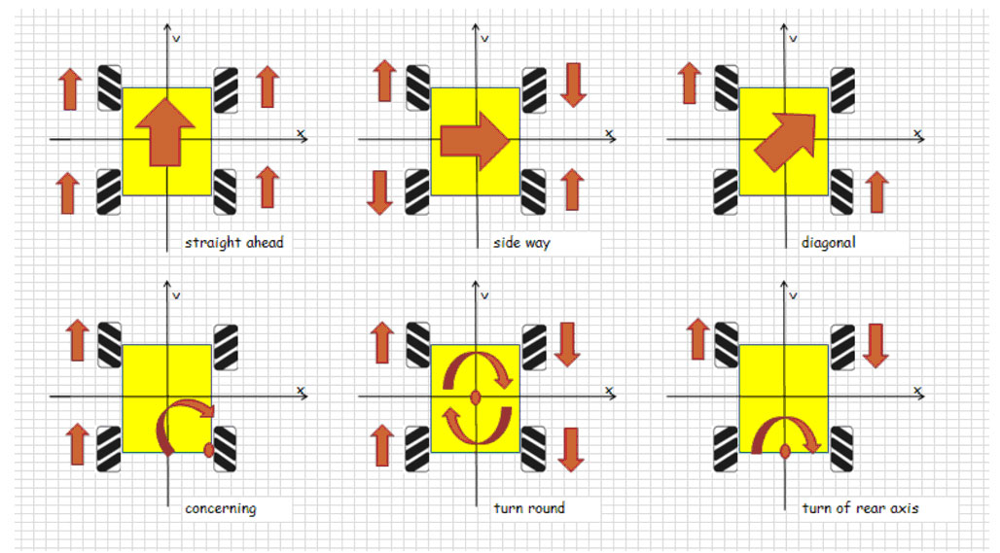

# Mecanum Wheel Motion Control
(*Generated by ChatGPT*)

Herw we provide an implementation for controlling the motion of a robot equipped with Mecanum wheels and MOrion (*a very old modified arduino board*). Mecanum wheels offer unique omnidirectional movement capabilities, enabling the robot to move in any direction without changing its orientation. This is achieved through the special design of the wheels, which consist of rollers mounted at an angle to the wheel's axis.

## Features

- **Omnidirectional Movement**: Move the robot forwards, backwards, sideways, and diagonally with ease.
- **Precise Control**: Fine-tune the movement for precise navigation and positioning.
- **Modular Design**: Easily integrate with different robot platforms and control systems.
- **Customizable Parameters**: Adjust speed, acceleration, and direction parameters to fit your specific needs.

## Getting Started

To get started with controlling a robot with Mecanum wheels, follow the instructions below.

### Prerequisites

- A robot chassis equipped with Mecanum wheels
- Motor drivers compatible with your robot's motors
- A microcontroller or computer to run the control software
- Basic understanding of robot kinematics and motion control

